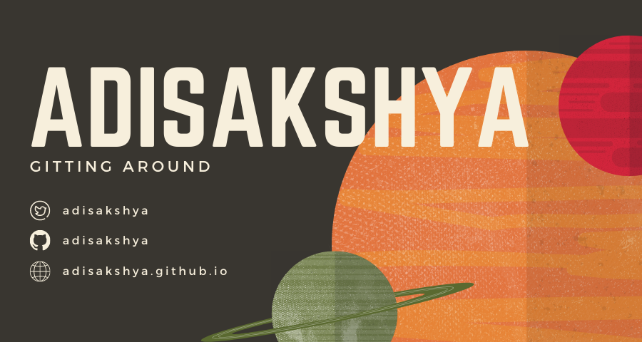

<!-- Banner Image -->
<!--  -->

## Hi there 👋
I'm a student and passionate self-taught backend developer from India.

 

## 🏆 Trophies

  

 

## ⚡ Recent Activity
<!--START_SECTION:activity-->
1. 🗣 Commented on [#1](https://github.com/jamesgeorge007/jamesgeorge007/issues/1) in [jamesgeorge007/jamesgeorge007](https://github.com/jamesgeorge007/jamesgeorge007)
2. 🎉 Merged PR [#8](https://github.com/adisakshya/playground/pull/8) in [adisakshya/playground](https://github.com/adisakshya/playground)
3. 💪 Opened PR [#8](https://github.com/adisakshya/playground/pull/8) in [adisakshya/playground](https://github.com/adisakshya/playground)
4. 🎉 Merged PR [#7](https://github.com/adisakshya/playground/pull/7) in [adisakshya/playground](https://github.com/adisakshya/playground)
5. 💪 Opened PR [#7](https://github.com/adisakshya/playground/pull/7) in [adisakshya/playground](https://github.com/adisakshya/playground)
<!--END_SECTION:activity-->
